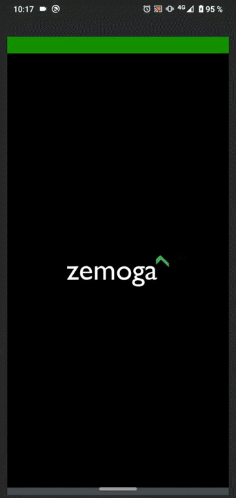
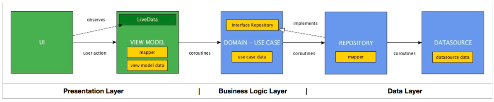

Zemoga Mobile Test for Android
==============================

Application to apply for android developer position in Zemoga company.

Application was developed using Android Studio 4.2.1 over windows OS, using
Androidx(that includes libraries for Android jetpack) and Kotlin language.

Application was designed under MVVM architecture that try to decouple the 
user interface as much as possible from the application logic.

for more information, see: https://developer.android.com/jetpack/guide

Dependencies
============

-   **viewpager2/tablayout:** Support of segmented control to filter posts (All / Favorites)

-   **room:** Support of data persistence

-   **navigation:** Library for easy android navigation between activity/Fragments

-   **material:** for modern and high quality Look & feel

-   **lifecycle:** for easy managment of activity/fragments lifecycle states

-   **coroutines:** Concurrency design pattern to simplify code that executes 
asynchronously.

-   **dagger-hilt:** Dependency Injection

-   **lottie:** Beautiful animation support using lottie files(JSON)

-   **retrofit2:** Type-safe HTTP client, that simplify API/WebServices request to 
consume JSON or XML data,

-   **junit:** Unit testing.

-   **espresso:** Integration unit testing.

Mobile test architecture
========================

Layers of application architecture:

Each layer should speak only to their immediate friends. In this case, if we look at 
the scheme of the software architecture:
-   The UI can only communicate with the ViewModel
-   The ViewModel can only communicate with the UseCase
-   The UseCase can only communicate with the Repository
-   And the Repository can only communicate with the Datasource

Project application was separated in diferent packages for this purpose:

**di**: Package for dependency injection classes(Get Room Database instance, 
and inject it to repository class).

**network.restapi**: Package to access remote datasource(Webservices/APIs)

**persistence** Package to access database entities, dao and instance.

**repository** Package to handle data operations. They provide a clean API so that 
the rest of the app can retrieve this data easily

**ui-viewmodel** Package that provides the data for a specific UI component, 
such as a fragment or activity, and contains data-handling business logic to 
communicate with the model.

**ui** Package for activity/fragments and all related to user interface interaction.

Application functionalities
============================

1. Load the posts from the JSON API and populate the sidebar: 
-   Application uses retrofit2 to connect with API.
-   Result of operation is returned to viewModel using 'Resource' sealed class
-	If all information is success downloaded, data is saved into local database.
-	database Post registers are displayed into 'AllFragment'

2. The first 20 posts should have a blue dot indicator.
3. Remove the blue dot indicator once the related post is read.
-   For each post, we have a flag to control if it was read or not.
-   Only the 20 first unread post, show blue dot indicator.
-	if Post is read, it is listed after all unread posts(end of list)

4. Once a post is touched, its related content is shown in the main content area.
-   Application navigate to a new fragment(Using android navigation) to show 
information in main content.

5. The related content also displays the user information.
-	database Post register is displayed into 'DescriptionFragment'

6. Add a button in the navigation. It adds the current post to favorites.
-   For each post, we have a flag to control favorite selection.
-	because Post is read before favorite selection, it is listed after all unread
 posts(end of list)

7. Each cell should have the functionality to swipe and delete the post.
-	Recycler view attached to ItemTouchHelper callback to control swipe/delete(RIGHT direction)

8. Add a button to the footer that removes all posts.
-   Remove all register from database. No request to API is made automatically.

9. Add a button to navigation that reloads all posts.
-   Request to API is made to download server posts/user & comments.
-	Recycler views are filled again.

10. Add a segmented control to filter posts (All / Favorites)
-   used Viewpager2 & tablayout.

11. Favorite posts should have a star indicator.
-   Show a yellow star in the rigth side of each post.

12. Cache all posts
-	I have decided to use Room because:
    is a lightweight android native solution. I have checked some internet blogs.
	https://medium.com/@farhanarnob/room-or-realm-database-for-android-2134773c1fa4v
	
13. Add animations when the user deletes each/all posts
-	I have used Lottie library.

14. Show a list of comments related to each post. It should be located in the main content area.
-	database User/Comments registers are displayed into 'DescriptionFragment'

15. Add unit testing as you consider it.
-	:( I'm studing recently about unit testing. No implemented yet.

